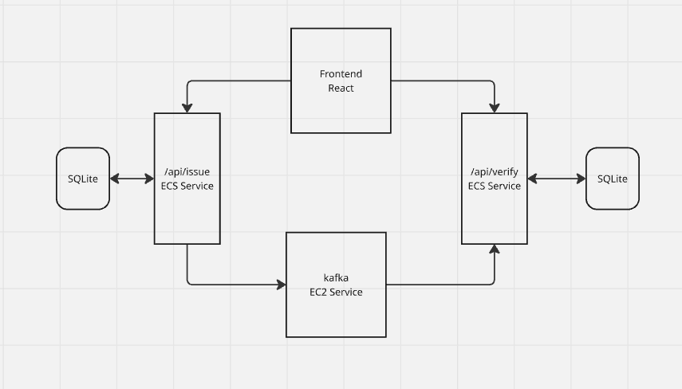

# kube-credentials-next-node-kafka-docker

Monorepo for a simple credentials workflow with a Next.js frontend and two Node.js/Express backend services communicating via Kafka.

## Architecture

- Frontend: `frontend/` (Next.js)
- Issuance Service: `backend/issuance-service/` (Express, publishes to Kafka)
- Verification Service: `backend/verification-service/` (Express, consumes from Kafka)
- Kafka stack via `docker-compose.yml` (Zookeeper + Kafka)

Data flow:
1) Client calls Issuance Service to create a credential → service stores it and publishes event `credential.issued` to Kafka.
2) Verification Service consumes `credential.issued` and persists credential copy for verification.
3) Client calls Verification Service to verify a credential.

### Component responsibilities

- Frontend: UI to trigger issuance and verification; shows results from backend APIs.
- Issuance Service:
  - Validates input, ensures `userid` presence.
  - Idempotent issuance: returns existing record if already issued.
  - Persists credential (SQLite) and publishes event to Kafka.
- Verification Service:
  - Subscribes to `credential.issued` and mirrors data into its store (SQLite).
  - Exposes verify endpoint to return `workerId` and `timestamp` when credential exists.
- Kafka: Durable event transport between services.

## Services

- Issuance Service
  - Default port: 3001 (configurable via `PORT` or Dockerfile ENV)
  - Publishes Kafka topic: `credential.issued`
  - Requires env: `KAFKA_BROKER` (defaults to `localhost:9092`)

- Verification Service
  - Default port: 3002 (configurable via `PORT` or Dockerfile ENV)
  - Consumes Kafka topic: `credential.issued`
  - Requires env: `KAFKA_BROKER` (defaults to `localhost:9092`)

- Frontend (Next.js)
  - Default dev port: 3000

Both backend services persist to SQLite locally.

## REST Endpoints

- Issuance Service (`backend/issuance-service`)
  - `POST /api/issue`
    - Body: JSON containing at least `{ "userid": string, ... }`
    - 201 Created on first issuance, 200 if credential already exists
    - Example response: `{ userid, workerId, timestamp, message }`
  - `GET /health` → `{ status: "ok" }`

- Verification Service (`backend/verification-service`)
  - `POST /api/verify`
    - Body: JSON containing at least `{ "userid": string }`
    - 200 with `{ workerId, timestamp }` if found, or `{ message: "Credential not found" }` if missing
  - `GET /health` → `{ status: "ok" }`

### cURL examples

Issue a credential (port 3001):

```bash
curl -s -X POST http://localhost:3001/api/issue \
  -H "Content-Type: application/json" \
  -d '{"userid":"alice","role":"admin"}'
```

Verify a credential (port 3002):

```bash
curl -s -X POST http://localhost:3002/api/verify \
  -H "Content-Type: application/json" \
  -d '{"userid":"alice"}'
```

## Environment variables

Common:
- `KAFKA_BROKER` (e.g., `localhost:9092` or `kafka:9092` in Docker)
- `PORT` (optional; defaults: issuance 3001, verification 3002)
- `WORKER_ID` (optional; defaults to hostname)

## Running with Docker Compose (Kafka only by default)

The included `docker-compose.yml` spins up Zookeeper and Kafka on your host:

```bash
docker compose up -d
# Kafka will be available on localhost:9092
```

Note: service blocks for issuance/verification are present but commented out; you can uncomment and adjust as needed (set `KAFKA_BROKER=kafka:9092` and publish ports `3001:3001`, `3002:3002`).

## Running services locally (without Docker containers for the apps)

Prereqs: Node 18+, npm, and `docker compose` (for Kafka), or an external Kafka broker.

1) Start Kafka via compose (or use your own broker):
```bash
docker compose up -d
```

2) Start Issuance Service:
```bash
cd backend/issuance-service
npm install
KAFKA_BROKER=localhost:9092 npm run dev
# or set PORT to override default 3001
```

3) Start Verification Service:
```bash
cd backend/verification-service
npm install
KAFKA_BROKER=localhost:9092 npm run dev
# or set PORT to override default 3002
```

4) (Optional) Start Frontend:
```bash
cd frontend
npm install
npm run dev
# open http://localhost:3000
```

## Build and run with Dockerfiles (per service)

Issuance:
```bash
cd backend/issuance-service
docker build -t issuance-service:local .
docker run --rm -p 3001:3001 -e KAFKA_BROKER=localhost:9092 issuance-service:local
```

Verification:
```bash
cd backend/verification-service
docker build -t verification-service:local .
docker run --rm -p 3002:3002 -e KAFKA_BROKER=localhost:9092 verification-service:local
```

## Testing

Each backend service has Jest tests:
```bash
cd backend/issuance-service && npm test
cd backend/verification-service && npm test
```

## Notes

- Kafka topic used: `credential.issued`
- SQLite is used for simple persistence in both services.
- CORS is enabled on both APIs for local development.

## Design decisions

- Event-driven via Kafka:
  - Decouples issuance from verification and enables horizontal scaling of consumers.
  - Allows future services to react to the `credential.issued` topic without coupling.
- Idempotent issuance:
  - Issuance endpoint checks for existing credential by `userid` and returns 200 with an informative message if already issued, avoiding duplicates and making retries safe.
- Simple storage with SQLite:
  - Lightweight persistence ideal for local/dev environments and tests; can be swapped for external DBs.
- Failure tolerance on publish:
  - Issuance service responds 201 even if Kafka publish fails (logged) to keep API responsive; eventual consistency can be monitored separately.
- Observability hooks:
  - `/health` endpoints for basic liveness; logs on Kafka connect/consume.
- Portability:
  - Dockerfiles per service; `docker-compose.yml` provides a local Kafka.

## Codebase structure

```
.
├─ docker-compose.yml              # Zookeeper + Kafka for local dev
├─ frontend/                       # Next.js app (App Router)
│  ├─ package.json                 # Frontend deps and scripts
│  ├─ next.config.ts               # Next.js config
│  ├─ postcss.config.mjs           # Tailwind/PostCSS config
│  ├─ tsconfig.json                # TS config
│  ├─ public/
│  │  ├─ file.svg
│  │  ├─ globe.svg
│  │  ├─ next.svg
│  │  ├─ vercel.svg
│  │  └─ window.svg
│  └─ app/                         # App Router pages and UI
│     ├─ layout.tsx                # Root layout
│     ├─ globals.css               # Global styles
│     ├─ favicon.ico
│     ├─ components/
│     │  └─ header.tsx            # Simple header component
│     ├─ page.tsx                  # Home page
│     ├─ issue/
│     │  └─ page.tsx              # Issue credential UI
│     └─ verify/
│        └─ page.tsx              # Verify credential UI
└─ backend/
   ├─ issuance-service/            # Issues credentials and publishes events
   │  ├─ src/
   │  │  ├─ index.ts              # Server entry, starts Express
   │  │  ├─ app.ts                # Express app wiring (CORS, JSON, routes)
   │  │  └─ routes.ts             # POST /api/issue
   │  ├─ tests/
   │  │  └─ issuance.test.ts
   │  ├─ Dockerfile
   │  └─ package.json
   └─ verification-service/        # Verifies credentials, consumes Kafka
      ├─ src/
      │  ├─ index.ts              # Server entry; starts consumer
      │  ├─ app.ts                # Express app wiring (CORS, JSON, routes)
      │  ├─ routes.ts             # POST /api/verify
      │  └─ kafka-consumer.ts     # Subscribes to credential.issued
      ├─ tests/
      │  ├─ verification.test.ts
      │  └─ kafka-consumer.test.ts
      ├─ Dockerfile
      └─ package.json
```


## Architecture


